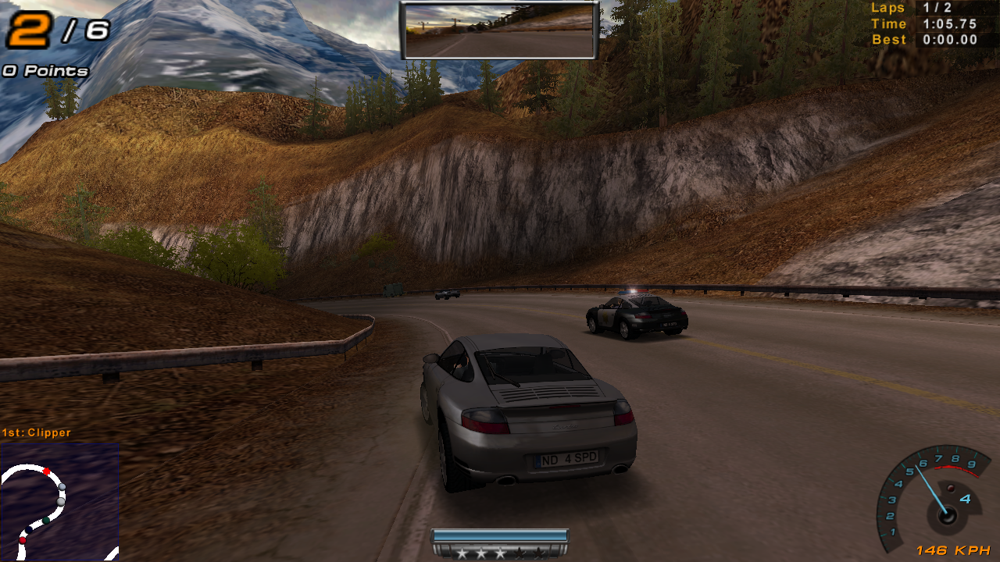
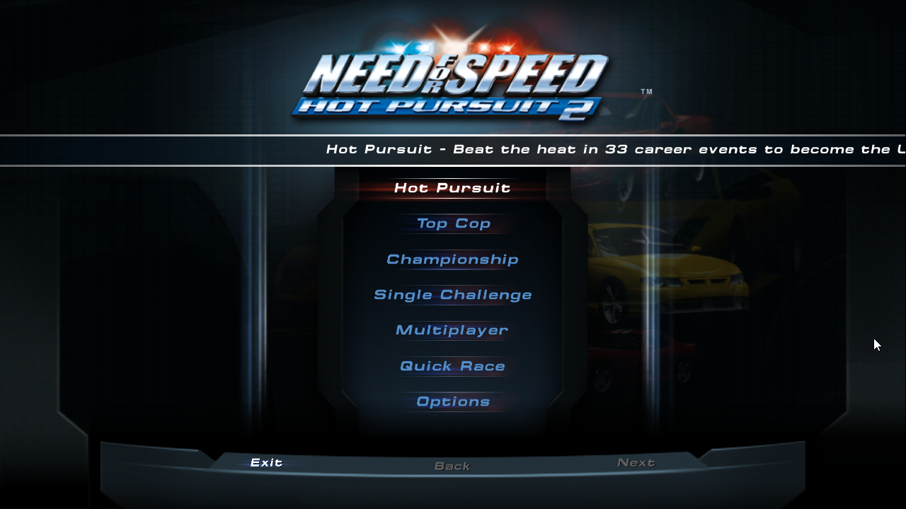
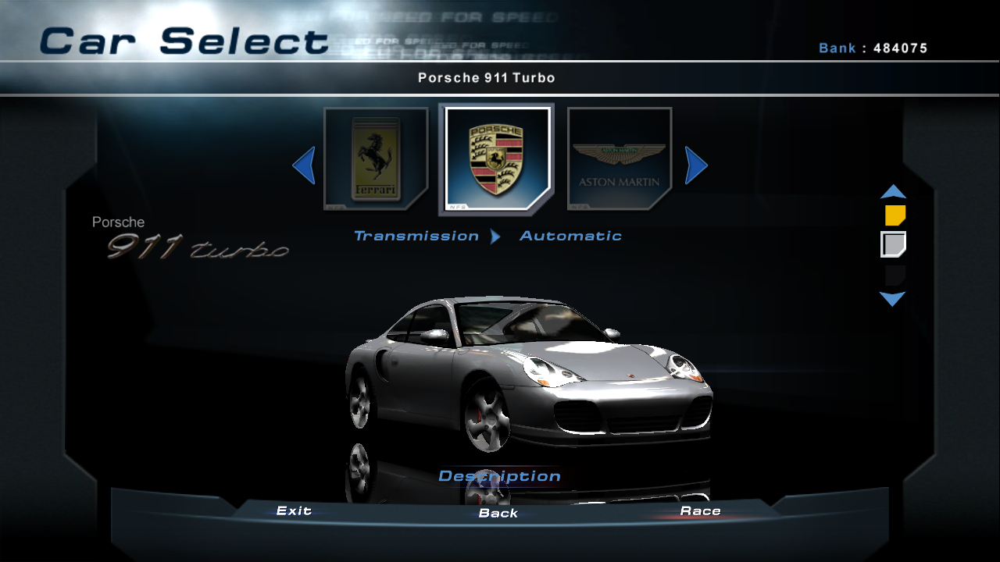
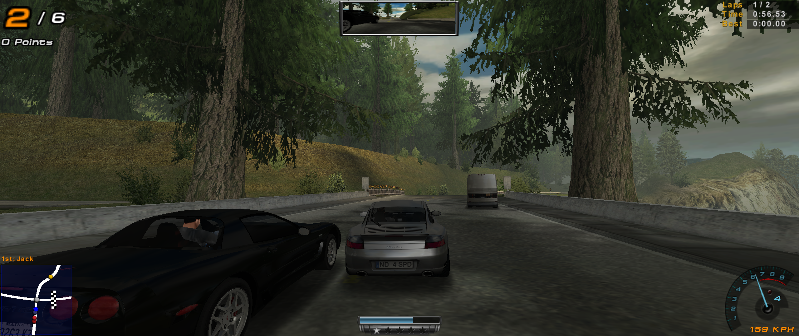
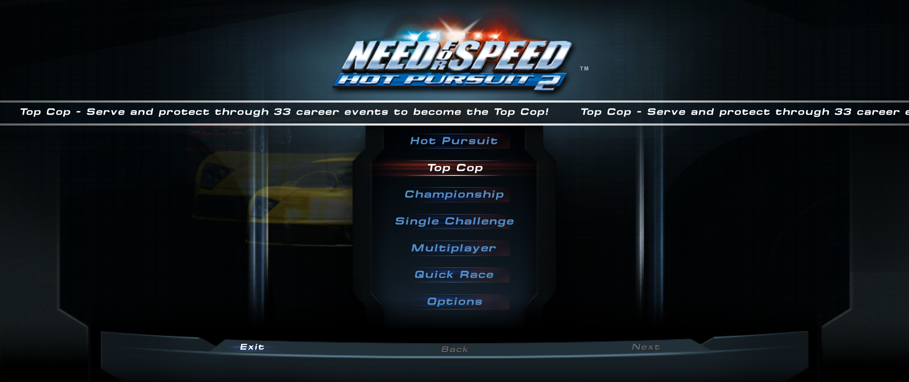
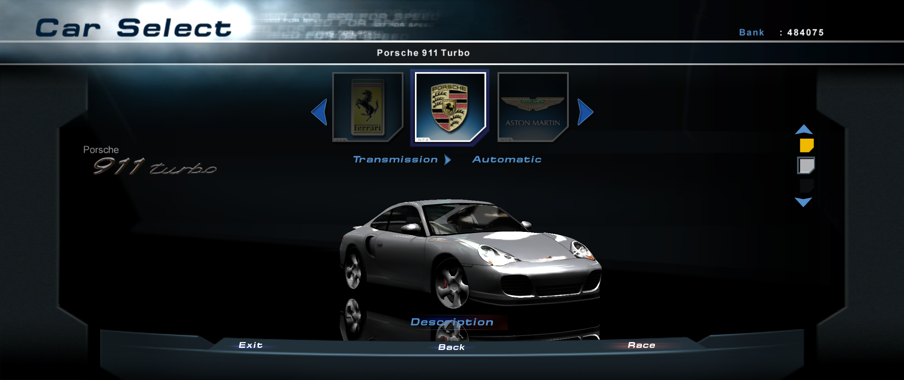

# HP2WSFix
A rudimentary widescreen fix for Need for Speed: Hot Pursuit 2 on PC

# Status
- Recalculates camera FOV
- Fixes ingame and FrontEnd resolution (permanently disables resolution limiting)
- FrontEnd element position scaling (or centering to 4:3)
- Configure and increase the memory allocations (e.g. for the render class (CLASS_RENDER) - this fixes higher poly models from crashing the game (e.g. car mods))
- d3d8to9 automatically enabled with the Ultimate ASI Loader (release binaries only)
- Reroute the save directory
- Ingame resolution changes are currently buggy (have to enter a race then exit or restart the game)
- Needs detail polish (multiplayer server browser, some menus not centered, etc.)

# Usage
- Extract the contents of the .zip file to the game's root directory.
- Go to your save directory (My Documents\EA Games), open rendercaps.ini and adjust your resolution under the [Graphics] key ([GraphicsFE] is unused)
- Check out HP2WSFix.ini for more adjustments
- If you have less than 1GB RAM: rename HP2WSFix_LowMem.ini to HP2WSFix.ini
- If any issues arise, install the VC++ 2015 - 2019 Redistibutable package: [DOWNLOAD LINK](https://aka.ms/vs/16/release/vc_redist.x86.exe)

# Requirements (for the release binaries)
- SSE2 capable CPU (Pentium 4 and newer)
- 1GB RAM for HD fonts and textures
- Windows XP or newer (Wine REQUIRES workaround, see below, WinXP doesn't have the console window possibility)
- Visual C++ Redistibutable 2015
- Version 242 (or version 1.32.20-R) of the game: [PATCH DOWNLOAD LINK](http://www.mediafire.com/view/xwj5zej5ejdlptt) & NoCD a patch for it

# Downloads
You should be able to download the files necessary in the Releases tab.

# WORKAROUND FOR WINE USERS:
- Rename the ASI loader from d3d8.dll to dinput.dll (NOT DINPUT8)
- In Wine configuration (winecfg) add a library override for dinput (it MUST be set to native first) [SCREENSHOT](https://raw.githubusercontent.com/xan1242/hp2wsfix/master/Screenshots/WineCfg.png)

Wine WILL throw exceptions for a pagefault at 0x5380e6, however, you can close Wine's exception handler and continue playing the game.
This is due to the game having its own exception handler and Wine doesn't like that at all...

# Credits
- ThirteenAG - for the injector, inireader and the Ultimate ASI Loader.
- EA Canada - the game code itself

# Screenshots
## Standard widescreen (1280x720)

## Ultrawide (2560x1080)

